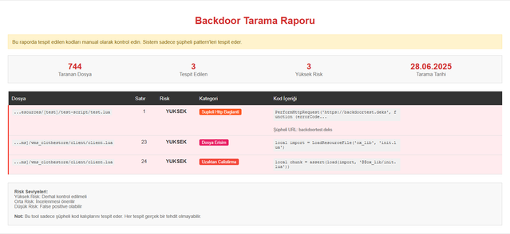

# FiveM Backdoor Checker

Bu Python tabanlı araç, FiveM sunucularındaki `.lua` dosyalarını tarayarak potansiyel backdoor (arka kapı) içeriklerini tespit eder. Tespit edilen şüpheli kodlar detaylı bir HTML raporu olarak sunulur.
---
 
---
## Özellikler

- Hızlı klasör tarama
- Regex tabanlı şüpheli kod tespiti
- `.lua` dosyalarını destekler
- HTML formatında kullanıcı dostu rapor üretimi
- Risk seviyelerine göre sınıflandırma (YÜKSEK, ORTA, DÜŞÜK)
- Şifreli kod, uzaktan kod çalıştırma, dış bağlantılar, dosya erişimi gibi kategorilere göre analiz

---

## Kurulum

Python 3.6 veya üzeri sürüm yüklü olmalıdır.

```bash
git clone https://github.com/deksdeveloper/fivem-backdoor-checker.git
cd fivem-backdoor-checker
python backdoor-checker.py
```
---

## Bilgilendirme
Bu projenin geliştirilmesinde Claude, ChatGPT gibi teknolojiler kullanılmıştır. 
